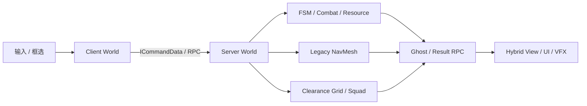

# AnimarsCatcher


AnimarsCatcher 是基于 Unity DOTS、Entities 与 NetCode for Entities 构建的 1v1 RTS 联机技术 Demo。项目通过一个可运行的对局原型，将数据导向模拟、按 Tick 预测、服务端权威规则、Ani 行为调度、大规模群体导航组合在一起，目标是塑造一个高性能，可联网，流程完整的 RTS 游戏体验。

项目的主要玩法为：玩家控制网络预测角色，框选 Picker 或 Blaster Ani，下达移动、跟随、目标交互与资源搬运命令，并通过战斗争夺领地，率先攻下对方基地的玩家获胜。

## 项目概览

| 技术链路 | 项目实现 |
|---|---|
| 运行环境 | 自定义 Client、Server、Thin Client World，支持 Host、Client 与 Dedicated Server |
| 网络与预测 | 自定义联机会话、RPC、Ghost Snapshot、`ICommandData` 与 KCC 预测移动 |
| 数据导向玩法 | Component 保存状态，System 执行行为，DynamicBuffer 传递业务事件 |
| Ani 行为 | Blob 状态图、类型化黑板、Burst FunctionPointer 与服务端 RTS 指令链路 |
| 导航与移动 | Legacy NavMesh 基线与自研 Clearance Grid 双后端，统一命令输入和 Benchmark Harness |
| 业务与表现 | 服务端战斗、资源和胜负，Client-only Hybrid View、HUD、动画与 VFX |

## 技术亮点

### 数据导向模拟与 Ani FSM

- Ani、生命值、阵营、资源、攻击和移动意图以 Component 或 DynamicBuffer 表达，由职责独立的 System 处理，Authoring 与 Baker 负责生成运行时数据
- 伤害与资源变化通过事件 Buffer 汇总，角色物理和相机等适合并行的计算使用 Burst、Job System 与 NativeContainer
- 通用 FSM 使用 Blob 状态图、类型化黑板和 Burst FunctionPointer，当前移动状态覆盖 Idle、Follow、Find 与 MoveTo

### NetCode 会话与预测输入

- 自定义 Bootstrap 创建 Client、Server 与 Thin Client World，并完成连接、Lobby、开局、场景就绪、InGame 和角色生成链路
- 服务器负责阵营、出生点、`GhostOwner` 与 `CommandTarget`，一次性命令使用 RPC，持续状态使用 Ghost Snapshot
- 玩家输入以 `ICommandData` 按 `NetworkTick` 写入命令缓冲，在客户端和服务器预测组中驱动 KCC，支持回滚与重放
- 支持 Host、Client、Dedicated Server、Multiplayer PlayMode 和局域网房间发现

### 双导航后端与群体移动

Legacy NavMesh 提供当前完整玩法基线和受控性能对照，包括服务端路径推进、固定阵型、FSM 移动、邻居分离与资源搬运

Clearance Grid 是正在接入正式玩法的新后端：

- 支持确定性 Grid 烘焙、Clearance、Region、Cluster、Portal 与动态 Overlay
- 提供稳定端点投影、八方向 A*、HPA Corridor、局部 Flow Field 与缓存调度
- Squad 共享路径上下文，使用稳定槽位分配和自适应紧凑矩形阵型，并通过单一边界提交服务器 Transform

### RTS 指令与服务端玩法闭环

- 客户端把框选和世界目标编码为 GhostId 快照与 `AniCommandRpc`，服务器复核连接、所有权和目标后再交给 FSM 或 Squad
- 指令链路保持“玩家意图 → 网络命令 → 服务端校验 → 行为调度 → 移动结果”，客户端不直接提交最终 Transform
- 战斗感知、攻击确认、伤害汇总、死亡、资源刷新与搬运、玩家资源统计和基地胜负均由 Server World 决定

### 画面、UI表现与工程边界

- 服务器保持纯 Entity 状态，Client World 创建并维护 GameObject View、动画、血条、选中光圈、HUD、音频和 VFX
- 网络与玩法通知通过 Presentation Bridge 转换为 UI 和场景行为，避免底层业务程序集直接依赖托管表现
- 331 个业务脚本归属 15 个自定义 asmdef，Runtime、Contracts、Editor、Validation 与 Benchmark 使用独立编译边界

## 系统结构



客户端负责采集输入、预测本地角色和呈现同步结果；服务器负责连接归属、Ani 指令、移动、战斗、资源和胜负。跨模块协作优先通过 Component、Buffer、RPC、Ghost 与通知 Entity 完成

## 技术栈

| 领域 | 当前实现 |
|---|---|
| 引擎与渲染 | Unity `6000.2.7f2`、URP `17.2.0`、Entities Graphics `1.4.16` |
| ECS | Entities `1.4.3`、Burst、Jobs、NativeContainer、Blob Asset |
| 网络 | NetCode for Entities `1.9.0`、Unity Transport `2.5.3` |
| 物理与输入 | Unity Physics `1.3.14`、Character Controller `1.3.12`、Input System `1.14.2` |
| 行为 | Blob FSM、DynamicBuffer Blackboard、Burst FunctionPointer、服务端玩法 System |
| 导航 | 自研 Clearance Grid、A*、HPA、Flow Field、Dynamic Overlay、Squad Formation |
| 表现 | Hybrid Entity View、UGUI、Cinemachine、DOTween、Audio Mixer、VFX |
| 工程化 | 15 个 asmdef、自动程序集审计、Stage Validation、固定回放 Benchmark |

## 当前开发状态

这是仍在演进的技术 Demo，当前已经具备可运行的联机业务闭环，但尚未达到正式游戏的内容量和发布门禁

已完成：

- 联机会话、按 Tick 预测角色、Ani 框选与指令、服务端战斗/资源/胜负，以及客户端 Hybrid 表现已经组成可运行闭环
- 331 个业务 C# 文件全部进入 15 个自定义 asmdef，主要运行时、契约、编辑器与验证边界已经拆分
- Legacy 与 Grid 后端可互斥运行；Navigation R1～R6 复审完成，Grid Stage 1～5 自动验证通过

仍在推进：

- Grid 正式场景的窄门、连续窄道和动态障碍退出验收
- 空间哈希、ORCA 局部避碰与世界碰撞
- 资源搬运迁移、Legacy 最终隔离、Navigation namespace 整理和最终构建门禁

未指定移动后端参数时，项目仍以功能完整的 Legacy NavMesh 作为默认玩法基线；Clearance Grid 需要通过 `-movement-backend=grid` 显式启用

## 运行项目

使用 Unity `6000.2.7f2` 打开项目，等待 Package、Entities 与 Ghost 代码生成完成，然后从 `Assets/Scenes/Bootstrap/SCN_MainMenu.unity` 进入正式流程。Windows 是当前主要开发与基准环境

常用运行参数：

```text
-host                         创建 Client + Server World
-client                       只创建 Client World
-dedicated                    只创建 Server World
-movement-backend=legacy      使用 Legacy NavMesh 后端
-movement-backend=grid        使用 Clearance Grid 后端
```

## 验证与审计

当前静态审计结果为 331/331 脚本归属、15 个 asmdef、0 个 asmref、0 个全局命名空间、0 组直接双向依赖、0 个边界违规和 0 个警告

运行程序集边界审计：

```powershell
powershell.exe -NoProfile -ExecutionPolicy Bypass -File .\Tools\AuditAssemblyMigration.ps1
```

R6 的 32、64、128 Ani 固定 Tick 双轮测试均全员到达，六轮主线程 Alloc P95 均为 `0 B`。完整参数、性能数据和确定性 Hash 见 [Navigation R1～R6 执行报告](docs/Architecture/Reports/NavigationRefactor-Execution-20260820.md)

## 文档

- [项目文档总目录](docs/README.md)
- [项目架构总览](docs/Architecture/README.md)
- [模块与资产地图](docs/Architecture/01_ModuleMap.md)
- [Grid 移动阶段与验收标准](docs/Architecture/10_GridMovementStagesAndAcceptance.md)
- [Navigation R1～R6 执行与验收](docs/Architecture/15_NavigationArchitectureRefactorExecutionPlan.md)
- [开发规范](docs/Standards/DevelopmentGuidelines.md)

## License

本项目使用 [MIT License](LICENSE)
