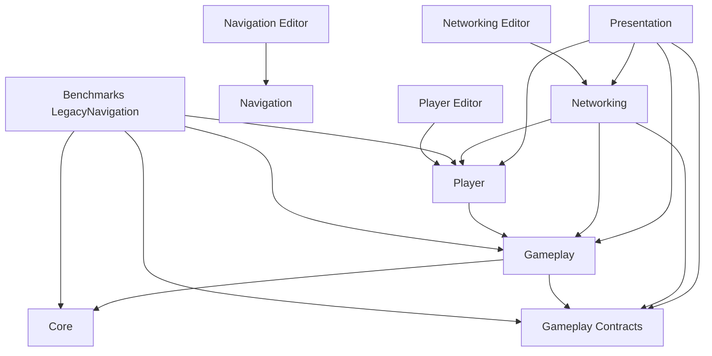

# 模块与资产地图

[返回架构总览](README.md)

本文档帮助开发者回答两个问题：某项功能现在由哪个模块负责，以及修改这项功能时应该先从哪里查起。当前全部项目业务脚本都已进入自定义 asmdef，目录职责同时受到编译器依赖边界约束。

## 1. 代码模块

项目可以从职责上分为底层契约、网络与玩家、核心玩法、表现与桥接、烘焙与编辑器工具五组。13 个项目程序集分别承载 Runtime、Editor、Authoring 和 Benchmark 生命周期，项目业务脚本不再位于 `Assembly-CSharp`。

### 1.1 底层契约

- **`Core/Fsm`**：保存通用 FSM 状态、上下文、黑板和 Blob 图数据，不包含 Ani 业务 ID、事件或具体运行 System
- **`Gameplay/Contracts`**：保存 Ani、Base、Camp、Health、Match 和 Resource 之间共享的 ECS Component、Tag、Buffer 与 RPC，不包含具体业务流程

### 1.2 网络与玩家

这一组负责创建运行环境、连接客户端与服务器，并把玩家输入转换为可预测的角色行为。

- **`Netcode`**：编译为 `AnimarsCatcher.Networking`，创建 Client、Server 和 Thin Client World，处理连接、监听、大厅、开局、进入 InGame、网络角色出生和常用网络工具。它单向依赖 Player、Gameplay 和 Contracts，并通过生命周期通知 Entity 向表现层发布通知
- **`Player`**：编译为 `AnimarsCatcher.Player`，采集设备输入，生成 `InputCommand`，驱动 KCC 预测移动，并管理相机和角色控制数据。输入在客户端产生，预测逻辑会在客户端和服务器共同执行，不反向依赖 Networking 或 Presentation；角色 GameObject View 已由 Presentation 接管
- **`Gameplay/Camp`**：保存阵营数据，执行服务器阵营分配，并在客户端维护本地阵营快照和敌我判断。它连接 NetCode 的连接实体、`GhostOwner` 和具体玩法模块

### 1.3 核心玩法

这一组主要在 Server World 中运行。客户端可以发起请求或显示结果，但不应直接决定战斗、资源和胜负。

- **`Gameplay/Anis`**：覆盖 Ani 属性、生成、框选目标解析、FSM Registry 与运行 System 及战斗。它直接位于 `AnimarsCatcher.Gameplay` asmdef 覆盖目录内，不再依赖 asmref
- **`Navigation/Grid`**：编译为独立的 `AnimarsCatcher.Navigation`，已实现编辑器 Physics 烘焙、静态 Cell 数据、运行时 Blob、端点投影和普通 A* 异步路径服务，但尚未接收正式移动命令或写入 Ani Transform
- **`Benchmarks/LegacyNavMesh`**：保存当前仍在运行的旧移动基线，包括旧 Movement FSM、固定阵型、逐 Ani NavMesh 路径、服务端命令消费和旧物理移动。它用于与规划中的 Clearance Grid 后端进行相同输入下的性能对比，不继续承载新玩法
- **`Gameplay/Resource`**：按 `Global`、`Player`、`Collection` 和 `Spawn` 划分，处理资源刷新、脆弱资源、搬运分配、玩家资源 Ghost 和比赛计时。服务器拥有最终资源数值，客户端只读取同步结果并显示；依赖旧 NavMesh 的搬运 Setup 和 Move 实现位于 Legacy Benchmark
- **`Gameplay/Health`**：收集伤害事件，汇总生命值变化，并处理普通实体死亡。它运行在服务器，是 Combat、Base 和 Resource 之间共享的结算入口
- **`Gameplay/Base`**：保存基地配置，负责基地出生、大小标签和 AABB 数据。它主要在服务器运行，并与 Camp、Health 和 Global 配合
- **`Gameplay/Global`**：处理服务器对局结果和基地败北。客户端结算 RPC、结果面板和会话返回位于 `Presentation/Match`

### 1.4 表现与桥接

这一组把 ECS 状态转换为玩家能看到和操作的 GameObject 界面。它可以读取权威状态或发送请求，但不应该直接改写服务器结果。

- **`Presentation/Selection` 与 `Presentation/Health`**：实现 ECS 框选、选择模式、选择光圈和血条 View，主要运行在 Client Presentation 阶段
- **`Presentation/Player` 与 `Presentation/Anis`**：负责角色 View 的生成、跟随、动画和攻击表现，把 ECS 状态转换为本地 GameObject 表现
- **`Presentation/UI`、`Account`、`Lan`、`Match` 等功能目录**：承载菜单、HUD、账号、局域网房间、结算、音频和场景过渡。表现层按业务功能组织，不再使用统一的 `MonoBehaviour` 技术目录

### 1.5 烘焙与编辑器支持

这些模块通常不直接参与玩法决策，而是在烘焙阶段准备运行时数据，或在编辑器中提供维护工具。

- **`Physics` 与 `Physics/Terrain`**：共同编译进 `AnimarsCatcher.Physics.Authoring`，提供通用胶囊体数据和 Terrain Collider 烘焙
- **`Editor`**：编译进 `AnimarsCatcher.Editor`，提供资源修复工具和程序集迁移总验收入口，只在 Unity Editor 中运行
- **`Navigation/Grid/Algorithms`**：保存与 Scene 和 World 解耦的烘焙算法、端点投影、确定性 A*、离散直线检查和代价保持平滑
- **`Navigation/Grid/Components`**：定义只读 Grid Blob、路径请求、生命周期状态和路径点 Buffer
- **`Navigation/Grid/Jobs`**：在 Burst Job 中顺序处理一个路径批次并复用整张 Grid 的 Scratch 内存
- **`Navigation/Grid/Systems`**：只在 Server 或 Local World 收集请求、异步调度 Job，并在后续 Tick 写回已完成结果
- **`Navigation/Grid/Editor`**：编译进 `AnimarsCatcher.Navigation.Editor`，提供 Grid Physics 采样、Hash、批量 Scene 覆盖层、数据检查、构建校验和阶段一、阶段二自动验收
- **`Gameplay/Editor`**：验证 Gameplay 程序集归属，并扫描全部正式 Scene 与 Prefab 的 Missing Script
- **`Player/Input/Editor`**：使用独立 Editor-only asmdef 检查 Input System 配置
- **`Netcode/Editor`**：使用 `AnimarsCatcher.Networking.Editor` 读取 Multiplayer PlayMode 配置，并通过纯数据桥传给 Networking Runtime
- **`Editor/AssemblyMigrationStageSevenValidation`**：验证全部项目程序集、显式引用策略、Physics Authoring 类型归属和此前阶段回归入口

原 `Obsolete` 目录已从 Unity 项目移除。需要追溯普通旧实现时使用 Git 历史，不在 `Assets` 中长期保留废弃源码。`Benchmarks/LegacyNavMesh` 是经确认的可执行性能基线例外，不得被当作正式扩展入口。

## 2. 依赖方向

下面的图表示当前主要调用和数据依赖。箭头说明现有代码会从哪里取得数据或调用能力，不表示允许新增任意反向引用。

新增跨模块功能时，优先通过 Component、RPC、事件或职责明确的窄接口连接。若两个模块开始相互持有大量实现细节，通常说明数据所有权或模块职责需要重新划分。

## 3. Scene 与 SubScene

三个启用场景并不是三个独立的玩法入口。主菜单负责会话准备，游戏场景负责客户端表现，SubScene 负责 ECS 配置和实体烘焙。

- **`Scenes/Bootstrap/SCN_MainMenu`**：提供登录、本地账号、创建或加入房间、LAN 发现和全局加载遮罩。关键对象包括 `EventBus`、`LanDiscoveryHost`、`LanDiscoveryClient` 和 `GlobalLoadingUI`
- **`Scenes/Gameplay/SCN_GameLevel`**：作为客户端表现壳，承载相机、HUD、选择面板、结算界面和开场运镜。关键对象包括 `MovementRaycastBootstrap`、`AniSelectionUIBootstrap`、`HealthHUDBootstrap` 和 `BattleIntroCinematic`
- **`Scenes/SubScenes/SCN_GameLevel_SubScene`**：提供 ECS 场景数据、Prefab 注册、出生点、资源刷新区和全局状态。关键对象包括 `PlayerRegistry`、`AniRegistry`、`ResourceRegistry`、`SpawnPoints`，以及当前禁用的 `GameResultRegistry`
- **`SCN_GridBakeStage1`**：位于 `Assets/Scenes/Benchmarks`，覆盖平地、坡道、窄路、台阶、障碍和静态孤岛，只用于 Grid 烘焙验收，不在 Build Settings 中

当前 Build Settings 同时列入主场景和 SubScene。是否需要把 SubScene 作为独立 Player 入口，应结合 Unity 的实际加载行为单独验证；本文只记录仓库现状，不把它视为已经确认的设计结论。

## 4. Prefab 分层

Prefab 按“是否参与网络同步”拆成 Network 和 Local 两层。Network Prefab 定义权威 Entity 与 Ghost，Local Prefab 只负责客户端视觉和声音。

- **`Assets/Prefabs/Network`**：放置 Ghost、权威 Entity、网络角色、Ani、基地和资源，例如 `PFB_ThirdPersonPlayer` 与 `PFB_Ani_*_Entity`
- **`Assets/Prefabs/Local`**：放置客户端 GameObject View、HUD、音频、VFX 和环境 Prefab，例如 `PFB_Ani_*_View` 与 `PFB_UI_AniHealthBar`
- **`Assets/Prefabs/Legacy/Resources`**：只保存旧场景仍需引用的 Crystal 与 Fruit Prefab，不作为新玩法资源入口
- **`Assets/Settings`**：保存 URP、Renderer、Volume、Lighting、Mixer 和 Build Profile 等项目级资产，例如 `URP-*.asset` 与 `AnimarsCatcher.mixer`

Network Entity Prefab 通过 `AvatarViewAuthoring` 和 `HealthBarViewAuthoring` 引用 Local View Prefab。客户端的 Presentation System 根据这些引用实例化 View，服务器不会创建对应的 GameObject 表现。

## 5. 按需求定位代码

定位问题时，先从拥有数据和规则的模块开始，再沿通信链路查找调用方。常见修改可以从以下位置进入：

- 修改连接、开局或角色出生时，先查看 `Netcode/Connection` 和 `Netcode/InGame`
- 修改玩家手感或预测时，先查看 `Player/Input`、`Player/Movement` 和 `Player/Hero/Control`
- 修改 Ani 指令和状态时，先查看 `Gameplay/Anis/Perception` 和 `Gameplay/Anis/FSM`；分析当前旧移动结果时查看 `Benchmarks/LegacyNavMesh`；修改新 Grid 烘焙基础时查看 `Navigation/Grid`，新移动能力不得继续写入 Legacy 目录
- 修改攻击和伤害时，先查看 `Gameplay/Anis/Combat` 和 `Gameplay/Health`
- 修改采集和资源经济时，先查看 `Gameplay/Resource` 和 `Gameplay/Anis/Spawn`
- 修改 HUD、选择表现或 Hybrid View 时，先查看 `Presentation/UI`、`Presentation/Selection`、`Presentation/Health`、`Presentation/Player` 和 `Presentation/Anis`
- 修改场景配置实体时，先查看 `SCN_GameLevel_SubScene` 和对应的 Authoring/Baker

如果一次修改同时跨越上述多个入口，应先明确哪个模块拥有最终数据，再决定其他模块是提交请求、同步状态还是只负责显示。
