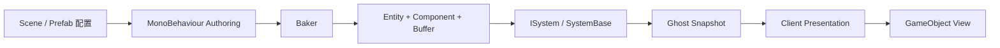
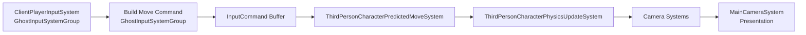
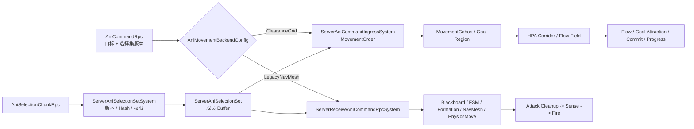

# ECS 数据模型

[返回架构总览](README.md)

## 1. 整体数据流

项目中的 ECS 数据大致经历以下过程：

1. 策划和开发人员在 Scene、Prefab 以及 Authoring 组件中填写配置
2. Baker 将这些配置转换为 Entity、Component 和 Buffer
3. System 读取配置并更新运行时状态
4. 需要联网的状态通过 Ghost Snapshot 从服务器同步到客户端
5. 客户端表现系统把 ECS 状态应用到 GameObject、动画、血条和其他 UI

这是当前项目最主要的运行模式，可以概括为“烘焙配置、系统处理、网络同步、客户端表现”。

项目并不是纯粹的非托管 ECS。Hybrid View 会通过 managed `IComponentData` 保存 GameObject 或 Prefab 引用，核心玩家 Ghost 上的 `CharacterTag` 也是 managed `IComponentData`。新增这类组件时，需要额外确认它是否会影响 Burst、并行查询以及 Ghost 序列化。

## 2. Entity、Component 与 System 的分工

- **Entity 表示一个运行时对象**。例如一个玩家、一只 Ani、一个基地或一份可搬运资源
- **Component 保存对象的数据和能力标记**。例如 `Health` 表示生命值，`Camp` 表示阵营，`PickerAniTag` 表示 Ani 类型
- **Buffer 保存长度可变的数据**。例如输入历史、寻路路径点和 FSM 黑板变量
- **System 执行行为**。例如处理输入、移动、攻击、资源刷新和胜负结算
- **Authoring 与 Baker 负责把编辑器配置转换成 ECS 数据**，它们不应承担运行时业务逻辑

当前项目主要使用组合来定义对象。System 不依赖某个传统类的继承层级，而是通过查询一组 Component 来确定自己应该处理哪些 Entity。

## 3. 主要 Entity 组成

下面只说明各类 Entity 的主干组成。具体 Prefab 还可能包含 Unity Physics、KCC、Transform 或 NetCode 自动生成的组件。

### 3.1 连接与玩家

- **连接 Entity** 由 NetCode 创建，包含 `NetworkId`、`NetworkStreamConnection`、`NetworkStreamInGame` 和 `CommandTarget` 等连接状态。服务器通过 `PlayerSpawnedTag` 防止同一个连接重复创建玩家角色
- **玩家角色 Ghost** 来自 `PFB_SmartCommandRobot_CharacterEntity`。它包含 KCC 组件、`ThirdPersonCharacter`、`ThirdPersonCharacterControl`、`CharacterTag`、`InputCommand` Buffer、`GhostOwner` 和 `Camp` 等数据。拥有者客户端负责本地预测，服务器执行相同模拟并提供最终校正
- **玩家控制 Entity** 由 `ThirdPersonPlayerControlAuthoring` 烘焙，包含 `ThirdPersonPlayerControl`、`PlayerInput` 和 `PlayerTag`。它描述客户端本地输入与受控角色之间的关系，不是服务器上的权威玩家状态
- **主相机 Entity** 只在客户端使用。它包含 `MainEntityCameraTag`，并根据相机模式带有 `FixedCamera` 或 `OrbitCamera` 以及对应的 Control 和 State 组件

### 3.2 Ani 与基地

- **Ani Ghost** 来自 `PFB_Ani_*_Entity`。它通常包含 `AniAttributes`、Picker 或 Blaster 类型 Tag、`Camp`、`Health`、FSM 数据、Legacy 导航组件和攻击状态；Grid 后端运行时还会维护 `AniSquadMembership`、`AniMovementConfig`、`AniSlotTarget`、`AniPreferredVelocity` 与 `AniMovementResult`
- Ani 的 FSM、寻路、移动规划、目标感知和伤害规则由服务器执行。当前 Grid 与 Legacy 移动后端互斥，客户端主要接收插值结果，并更新朝向、动画、选择效果和 View
- **Base Ghost** 从 `BaseSpawnPoint` 生成。它使用 `BaseTag`、Big 或 Small 类型 Tag、`Camp`、`Health`、`RangedAttackableTag` 和 `BaseWorldAABB` 等组件表达阵营、体型、可攻击性和空间范围
- 基地生命值和败北判定由服务器维护，客户端只负责显示血条和最终结果

### 3.3 资源与比赛状态

- **可搬运资源 Ghost** 包含 `PickableResource`、`PickableResourceTag` 和 `PickableResourceCarrierSlot` Buffer。搬运期间还会附加任务与锁定相关组件，整个分配和交付过程由服务器决定
- **脆弱资源 Ghost** 包含 `FragileCrystal`、`AttackableResourceTag`、`Health` 和掉落配置。服务器处理受伤、破坏和掉落
- **玩家资源 Ghost** 由 `ServerPlayerResourceInitializationSystem` 创建，包含 `PlayerResourceTag`、`PlayerResourceState` 和 `GhostOwner`。服务器写入资源值，所属客户端读取同步结果
- **全局比赛资源 Entity** 由 SubScene Authoring 产生，包含 `GlobalGameResourceTag` 和 `GlobalGameResourceState`。Server System 只更新 Server World 中的实例；这个场景 Entity 没有形成实际 Ghost 同步链路，因此 Client World 中的副本不会得到服务器比赛时间
- **对局结果 Entity** 包含 `GameResult`，由 `ServerBaseSpawnSystem` 创建。它是 Server-only 数据，最终胜方通过 `MatchResultRpc` 广播给客户端。SubScene 中还保留了一个当前禁用的 `GameResultAuthoring`

### 3.4 场景注册 Entity

SubScene 的 Baker 还会生成一批供 System 查询的注册数据，包括：

- 玩家、相机和 Ani 的 Prefab 引用
- 玩家与 Ani 出生点
- 资源刷新区域及其候选 Prefab
- 食物和水晶变化事件 Hub
- 选择光圈、血条和 Entity View 配置

这些 Entity 本身通常不代表玩家可见对象，而是为服务器或客户端 System 提供场景级配置入口。

## 4. Component 的使用方式

### 4.1 静态配置

静态配置由 Baker 写入，运行时通常只读。例如 `AniAttributes`、`AniPhysicsConfig`、`NavigationGridReference` 和 `PickableResource`。`NavAgent` 属于仍由 Legacy 后端使用的静态配置。如果一项数据需要在运行时频繁变化，就不应继续把它当作静态配置使用。

### 4.2 运行时状态

运行时状态由 System 跨帧维护，例如 `AniAttackState`、`AniSquadPathState`、`AniSquadFormationState`、`ServerMatchStartState` 和 `ResourceCarryAssignment`。`NavSteering` 是 Legacy 后端的运行时状态。它们描述“对象当前正在做什么”，而不是“对象初始应该是什么”。

### 4.3 网络同步状态

`Camp`、`Health`、`PlayerResourceState` 和 `AniAttackFireRequest` 等组件由服务器写入，并根据 Ghost 配置同步给客户端。客户端可以读取这些状态来更新表现，但不应直接把本地修改当作权威结果。

### 4.4 输入与一次性请求

- `InputCommand : ICommandData` 用于逐 Network Tick 的连续输入，支持客户端预测和回滚
- `AniSquadCommandRequest`、`ResourcePickupRequest` 以及 RPC Entity 属于一次性请求，处理完成后应移除或销毁；`AniFormationJoinRequest` 只属于 Legacy 链路

连续输入和一次性业务请求不应混用。前者需要保留 Tick 历史，后者只需要被可靠地消费一次。

### 4.5 Tag 与 Enableable Component

- `PickerAniTag`、`BaseTag` 和 `EntityViewSpawnedTag` 等普通 Tag 表示稳定类型或生命周期阶段
- `AniSelectedTag`、`AniInTeamTag` 和 `AniCommandLockedTag` 等 Enableable Component 适合高频开关状态，可以减少结构变化

### 4.6 Managed Bridge

`EntityViewConfig`、`HealthBarViewConfig` 和 `AniSelectionUIReference` 等 managed `IComponentData` 用于在客户端 World 中保存托管对象引用。它们是 ECS 与 GameObject 表现层的桥梁，不应进入服务器核心结算路径。

## 5. 关键 Buffer

- `InputCommand` 挂在玩家角色 Ghost 上，保存 NetCode 输入历史，并参与预测和回滚
- `FsmVar` 挂在 Ani 上，作为 FSM 黑板保存命令模式、目标和导航状态
- `NavWaypoint` 挂在 Ani 上，保存 Legacy NavMesh 规划得到的路径点
- `AniSquadCommandMember` 保存通过服务器权限校验的指令成员快照，`AniSquadMember` 和 `AniFormationSlot` 保存当前 Squad 成员与阵型槽位
- `NavigationPathWaypoint` 保存 Grid 完整路径结果，`NavigationCorridorCluster`、`NavigationCorridorPortal` 和 `NavigationFlowFieldCell` 保存 Squad 共享的 Corridor 与局部 Field
- `DamageEvent` 挂在可受伤 Entity 上，保存待结算伤害。当前命中链路使用 `AddBuffer` 写入时会替换已有 Buffer 内容，因此不能可靠汇总同一结算周期内的多次命中
- `PickableResourceCarrierSlot` 挂在可搬运资源上，保存 Picker 相对资源的搬运站位
- `FoodResourceDeltaEvent` 和 `CrystalResourceDeltaEvent` 位于资源事件 Hub，记录指定 `NetworkId` 的资源增量
- `CharacterSpawnPointElement` 保存各阵营角色的出生位置和旋转
- `FoodResourceSpawnPrefabReference` 与 `CrystalResourceSpawnPrefabReference` 保存刷新区域可随机生成的资源 Prefab
- `ServerAniSelectionSet` 保存玩家权威选择集的版本、成员数和完整性 Hash，`ServerAniSelectionMember` Buffer 保存按 GhostId 升序排列的唯一成员
- `ServerAniSelectionAssemblyChunk` 与 `ServerAniSelectionAssemblyMember` 只在分块尚未收齐时保存组装状态，完成、冲突或超时后立即销毁
- `AniMovementOrderMember` 保存移动命令创建时冻结的成员、移动能力和 Agent Profile，正式 Grid 入口不再生成 `AniSquadCommandMember`
- `AniMovementCohort` 与 `AniMovementCohortMember` 保存有界寻路单元和稳定成员顺序，`AniMovementCohortMembership` 保证每名 Ani 同时只属于一个活动 Cohort
- `AniMovementOrderState` 分开保存本 Tick 原始目标、最近分配使用的原始目标和实际投影中心；`AniMovementCohortPathState` 使用该投影中心提交 Flow 请求
- `AniGoalAssignment` 保存目标 Cell、自然落点、到达半径和目标版本，不包含矩形列数、职责或固定阵型槽位
- `NavigationSharedFlowFieldRecord` 位于服务器全局 Field Store，独立持有 Corridor、Portal、Waypoint 和 Flow Cell Buffer；`NavigationFlowFieldHandle` 让多个 Cohort 引用同一份只读结果
- `NavigationFlowFieldQueueState` 记录单个 Cohort 的入队、开工、完成和取消版本，Store Entity 上的 `NavigationFlowFieldSchedulerState` 与等待样本 Buffer 提供队列、缓存和构建报告

## 6. Authoring、Baker 与注册数据

### 6.1 玩家和 Ani

- `PlayerPrefabRegistryAuthoring` 提供 `CharacterGhostPrefabReference` 和 `CameraGhostPrefabReference`，由 `ServerHandleReadyForGameRpcSystem` 在玩家就绪后使用
- `AniPrefabRegistryAuthoring` 烘焙出 `AniGhostPrefabRegistry`，由 `ServerSpawnAnisSystem` 创建 Ani
- `CharacterSpawnPointsAuthoring` 提供玩家出生点组、阵营和选择模式
- `AniSpawnPointAuthoring` 烘焙 `AniSpawnPointTag`、`Camp` 和 Transform，供 Ani 生成链路查询

### 6.2 资源

- `ResourceSpawnAreaAuthoring` 保存刷新区域配置以及食物、水晶 Prefab Buffer，由 `ServerResourceRespawnSystem` 使用
- `PlayerResourceDeltaHubAuthoring` 创建食物和水晶变化事件 Buffer，资源结算系统通过它们把增量应用到对应玩家

### 6.3 客户端表现

- `EntityViewAuthoring` 提供 `EntityViewConfig`，由 `ClientSpawnEntityViewSystem` 创建 Entity View
- `HealthBarViewAuthoring` 提供 `HealthBarViewConfig`，由 `ClientSpawnHealthBarViewSystem` 创建血条
- Camera Authoring 负责相机配置、控制组件和忽略列表
- Terrain 与 Physics Authoring 负责 Collider 和探测配置，供 Unity Physics 与 Ani 物理系统读取

## 7. Aspect 的职责

当前项目主要有两类关键 Aspect：

- `ServerGetConnectionAspect` 封装连接 Entity 上的 `NetworkId`、InGame 标记、出生去重状态以及 `CommandTarget` 写入
- `ThirdPersonCharacterAspect` 封装 KCC 角色更新所需的数据，并实现 Character Controller Processor

Aspect 适合包装同一个 Entity 上需要高频共同访问的数据，不负责跨模块业务编排。连接、战斗、资源等长流程仍应由多个 System 协作完成。

## 8. System 调度

### 8.1 客户端输入和预测

客户端先采集设备输入并构造 `InputCommand`，随后玩家角色在预测固定步长中执行移动。KCC 负责实际物理更新，相机和主相机输出在后续阶段跟随角色状态更新。

相关 System 主要分布在以下 Group：

- `GhostInputSystemGroup` 负责输入采集、移动命令和 `CommandTarget` 绑定
- `PredictedFixedStepSimulationSystemGroup` 在客户端和服务器执行玩家预测移动
- `KinematicCharacterPhysicsUpdateGroup` 在客户端和服务器执行 KCC 物理更新
- `PresentationSystemGroup` 在客户端更新框选 UI、选择光圈、血条和主相机

### 8.2 Ani 服务端主链

服务器先组装并发布玩家选择集，移动 RPC 只引用已经确认的版本和 Hash。Grid 链路生成 `MovementOrder` 后按 Agent Profile、起始 Cluster、Morton Key 和 StableId 切成默认最多 64 人的 Cohort，再分配自然目标落点并驱动自由移动；Stage 4～5 Squad 只由历史 Benchmark 和专项回归直接创建。Legacy 链路读取同一份权威选择集后继续通过 Blackboard、FSM、旧阵型、逐 Ani NavMesh 和物理移动执行。攻击相关 System 仍从现有 FSM 状态出发，完成目标感知、冷却和开火。

Grid 链路已通过 `AniGridCommandIngressSystemGroup`、`AniGridRuntimeSystemGroup`、`UpdateAfter` 和 `UpdateBefore` 固定顺序。Legacy 的 Planner、Nav Planner 和 Follow 之间仍有顺序缺口，见 [已知边界](07_KnownRisks.md)。

服务器的 Ani、战斗、资源、出生和胜负逻辑主要运行在 `SimulationSystemGroup`。客户端的自动连接、View 生成和输入锁同步主要运行在 `InitializationSystemGroup`。

## 9. 生命周期约定

1. 一次性 RPC 和请求组件在处理后销毁或移除
2. Persistent NativeContainer 在 System 的 `OnDestroy` 中释放
3. View 生成后写入 Spawned Tag，避免重复实例化
4. 连接 Entity 使用 `PlayerSpawnedTag` 防止重复创建玩家角色
5. Ghost 的稳定组件优先在 Baker 或 Prefab 中预先添加
6. 高频开关状态优先使用 Enableable Component，减少结构变化
7. 新增 managed `IComponentData` 前，需要确认运行 World、访问线程、Burst 限制和序列化需求
