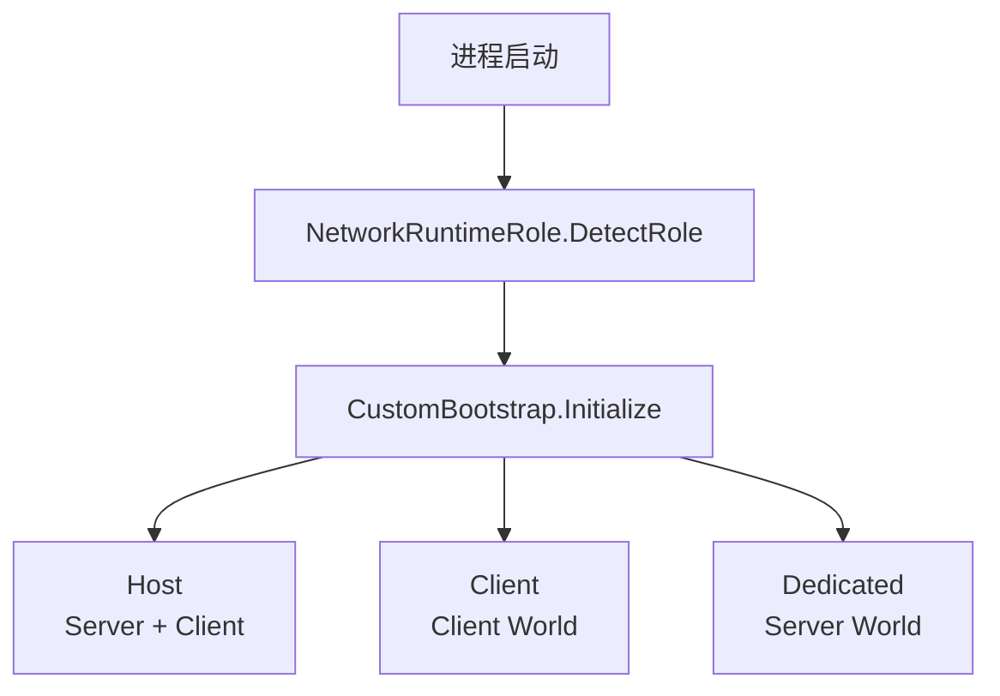
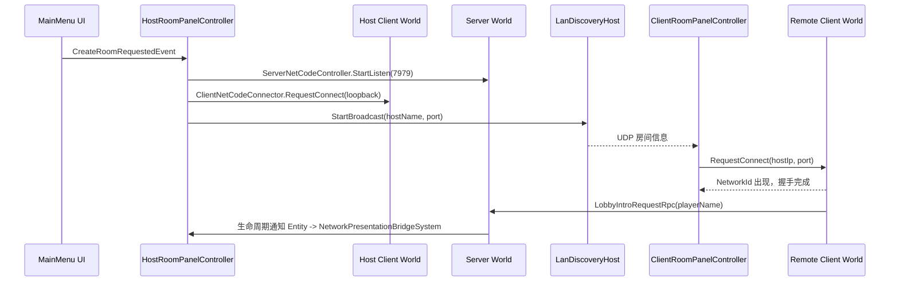
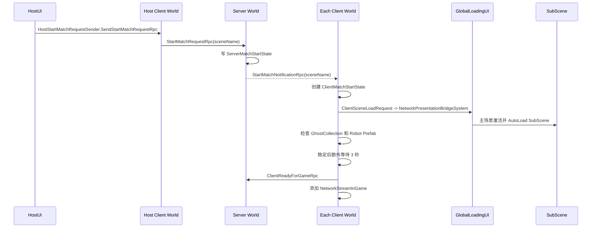
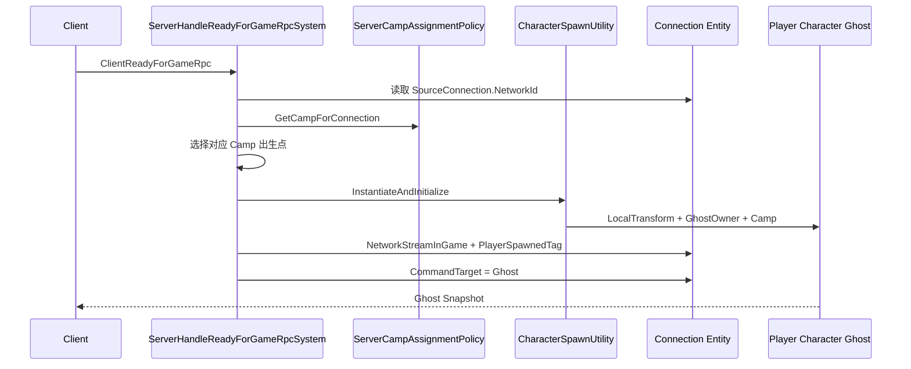

# 启动、连接与开局链路

[返回架构总览](README.md)

本文按一次正式联机对局的时间顺序，说明进程如何创建 World、玩家如何进入房间，以及客户端和服务器如何完成开局握手与角色绑定。

## 1. 三个场景分别负责什么

项目把菜单、客户端表现和 ECS 游戏数据拆在三个场景中。

- `SCN_MainMenu` 是联机入口。账号、创建房间、加入房间和 LAN 房间发现都从这里开始，同时创建跨场景保留的 `PresentationEventBus` 与 `GlobalLoadingUI`
- `SCN_GameLevel` 是客户端看到的游戏外壳。HUD、相机、开场运镜和其他 GameObject 表现放在这里
- `SCN_GameLevel_SubScene` 保存需要烘焙进 Entity World 的内容，例如 Ghost Prefab 注册、角色出生点、资源刷新区域、全局状态和 ECS 配置。它由 `SCN_GameLevel` 自动加载

因此，主场景主要解决“玩家看到什么”，SubScene 主要解决“ECS World 中存在什么”。排查缺少 Entity 或 Prefab 注册的问题时，应优先检查 SubScene，而不是只检查 `SCN_GameLevel` 的层级。

## 2. 进程如何创建 World



`CustomBootstrap` 根据 `NetworkRuntimeRole.DetectRole` 的结果决定创建哪些 World。

1. 普通 Client 只创建 Client World。构建版本没有启动参数时会走这一分支
2. Host 同时创建 Server World 和 Client World，需要使用 `-host`
3. Dedicated Server 只创建 Server World，需要使用 `-dedicated`

每个新建 World 都会调用 `AniMovementBackendWorldUtility.ConfigureWorld` 写入唯一的移动后端配置。`-movement-backend=grid` 或 `-movement-backend=clearance-grid` 选择 Grid，`-movement-backend=legacy` 选择 Legacy；未指定时默认使用 Legacy。`AniMovementBackendGuardSystem` 会拒绝配置缺失、重复或两个后端 Tag 同时存在的 World。

Bootstrap 只决定 World 的种类，不会直接替业务选择地址并建立连接。服务器监听和客户端连接仍由菜单或调试入口显式发起。

## 3. 创建房间和加入房间



房主创建房间后会同时做三件事：让 Server World 监听端口、让本机 Client World 连接回环地址，以及通过 UDP 广播房间信息。远端客户端发现房间后，使用广播中的地址和端口发起连接。

NetCode 为连接分配 `NetworkId` 后，客户端通过 `LobbyIntroRequestRpc` 上报玩家名称。服务器再把成员加入事件转给房主 UI。

当前大厅成员信息主要存在于 UI 事件链中，没有独立、持久化的 Lobby Entity，也没有完整的成员状态机。这意味着大厅重建、掉线恢复和成员状态同步都不应假定已有权威大厅模型。

## 4. 房主开始对局



开始对局不是“切换场景”一个动作，而是一次客户端和服务器之间的 Ready 握手。

1. 房主客户端发送 `StartMatchRequestRpc`
2. 服务器写入 `ServerMatchStartState`，并向所有客户端广播 `StartMatchNotificationRpc`
3. 客户端收到通知后创建 `ClientMatchStartState` 和 `ClientSceneLoadRequest`，再由 `NetworkPresentationBridgeSystem` 调用 `GlobalLoadingUI` 异步加载游戏场景
4. 主场景激活后，Unity 加载 SubScene 中已经烘焙好的实体数据和 Ghost 注册信息
5. `ClientSendReadyForGameRpcSystem` 等待 `GhostCollection` 和 Robot Prefab 可用，并在当前实现中额外等待 3 秒
6. 客户端发送 `ClientReadyForGameRpc`，双方连接进入正式的 InGame 阶段

`ServerMatchStartState` 还承担一次性保护，避免同一局重复广播开始通知。`NetworkStreamInGame` 则是 NetCode 的阶段标记：连接拥有它之后，Ghost 快照和输入命令才进入正常游戏链路。

## 5. 服务器创建玩家角色



服务器收到 `ClientReadyForGameRpc` 后，以 RPC 自带的源连接为身份依据，不接受客户端自行声明玩家编号。它先通过 `ServerCampAssignmentPolicy` 确定阵营，再选择对应出生点并创建玩家角色 Ghost。

出生完成后，服务器会在连接 Entity 上完成三项设置：

- 添加 `NetworkStreamInGame`，使连接进入游戏阶段
- 添加 `PlayerSpawnedTag`，防止重复出生
- 把 `CommandTarget` 指向新角色，让该连接上传的 `InputCommand` 路由到正确的 Ghost

新角色上的 `GhostOwner` 决定所有权，`Camp` 决定阵营。服务器生成的 Ghost 快照到达客户端后，本地才能继续建立输入和相机引用。

## 6. 客户端绑定输入和相机

`ClientEnsureCommandTargetSystem` 在客户端找到本地拥有的 owner-predicted 角色，并补齐客户端引用。

1. 从本地连接读取 `NetworkId`
2. 查找 `GhostOwner.NetworkId` 相同、同时带有 `CharacterTag` 和 `PredictedGhost` 的角色
3. 把本地连接的 `CommandTarget` 指向该角色
4. 更新 `ThirdPersonPlayerControl.ControlledCharacter`
5. 查找 `MainEntityCameraTag`，并写入 `ControlledCamera`

这里同时依赖连接 Entity、角色 Ghost 和相机 Entity。角色已经在服务器出生但本地仍不能操作时，应分别确认这三类对象是否到达，而不是只检查角色是否可见。

## 7. 开局阶段的重要状态

这些状态分布在不同 World 和 Entity 上，各自解决一个明确问题：

- `ServerMatchStartState` 只存在于 Server World，记录场景名以及开局请求、广播和角色出生进度
- `ClientMatchStartState` 只存在于 Client World，表示客户端已经收到服务器的开局通知
- `NetworkStreamInGame` 同时出现在客户端和服务器的连接 Entity 上，表示连接已经进入正式对局
- `PlayerSpawnedTag` 位于服务器连接 Entity 上，用于阻止同一连接重复创建角色
- `CommandTarget` 位于连接 Entity 上，把 NetCode 命令流路由到对应的角色 Ghost

这些状态不是同一个“大状态机”的字段。排查问题时需要先判断故障发生在服务器开局、客户端加载、连接 InGame，还是角色命令绑定阶段。

## 8. Editor 直接进入游戏场景

Editor 直接打开 `SCN_GameLevel` 时会走一条独立的调试路径：

```text
ServerStartListenSystem / ClientStartConnectionSystem
-> ClientSendDebugEnterGameRpcSystem
-> DebugEnterGameRpc
-> ServerHandleDebugEnterGameRpcSystem
-> 调试角色出生
```

这条路径绕过主菜单、大厅、`StartMatchRequestRpc`、正式场景过渡和 Ready 判定，只用于本地联调。因此，Editor 中能直接进入游戏并不代表正式房间链路也能工作。排查开局故障时应先确认当前使用的是哪一条路径。

## 9. 返回主菜单

`GameSessionController.ReturnToMainMenu` 当前按以下顺序执行：

1. 逆序 Dispose 当前进程中的 GameClient 和 GameServer World
2. 恢复 `Time.timeScale = 1`
3. 同步加载 `SCN_MainMenu`

当前没有发现返回菜单后显式重新执行 Bootstrap 并重建 World 的路径。因此，从一局游戏返回后再次创建或加入房间属于需要专项验证的生命周期场景。

## 10. 按时间顺序排查开局问题

遇到无法进入游戏、没有角色或无法控制时，可以从前往后检查：

1. 服务器是否已经创建 `NetworkStreamRequestListen`
2. 客户端是否存在 `NetworkStreamRequestConnect` 或已经建立 `NetworkStreamConnection`
3. Client World 是否已经获得 `NetworkId`，确认握手已经完成
4. `ServerMatchStartState.MatchStartRequested` 是否为 `1`，确认服务器接受了开局请求
5. `ClientMatchStartState.Active` 是否为 `1`，确认客户端收到了切换场景通知
6. 客户端连接是否带有 `NetworkStreamInGame`，确认 Ready 阶段结束
7. 服务器连接是否带有 `PlayerSpawnedTag`，并拥有有效的 `CommandTarget`
8. 客户端本地 `CommandTarget` 是否指向 owner-predicted 角色

如果某一步缺失，应优先检查它前一个步骤的发送方和当前步骤的接收系统，避免从最终的角色表现反向猜测整个链路。
