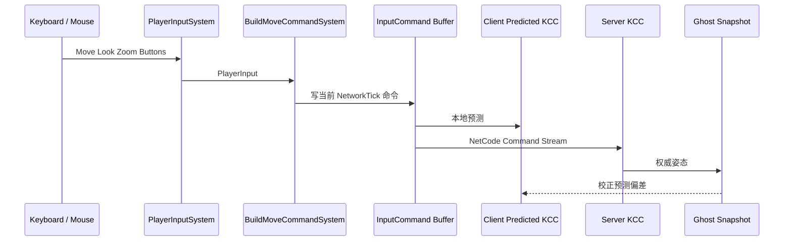
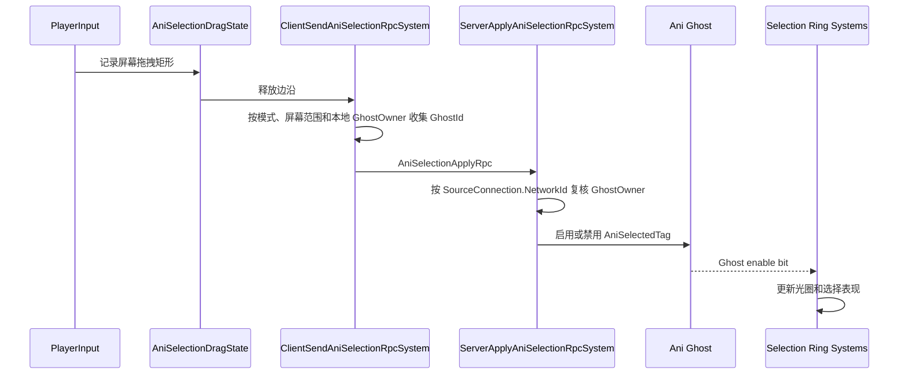
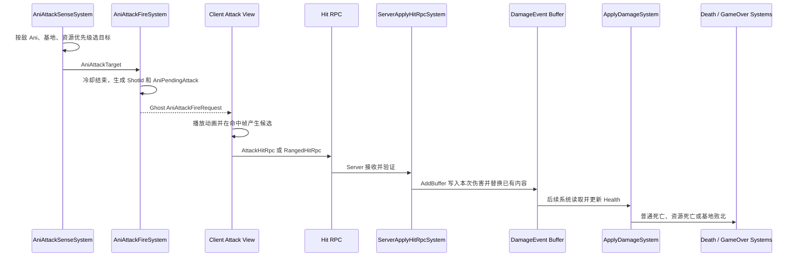
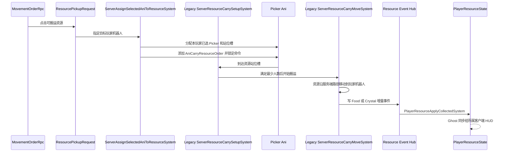
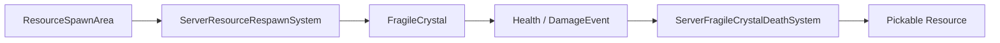
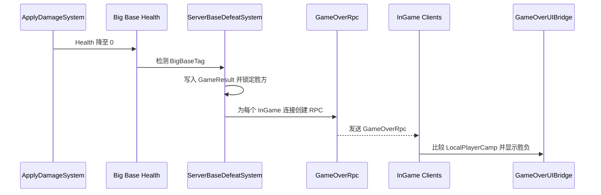

# 核心玩法链路

[返回架构总览](README.md)

本文从玩家操作出发，说明输入如何进入 ECS、服务器如何形成权威结果，以及客户端表现如何接收同步数据。

## 1. 玩家主角移动

客户端先由 `PlayerInputSystem` 采集键盘和鼠标状态，再由命令构建系统把输入写入当前 `NetworkTick` 对应的 `InputCommand`。同一份命令一边驱动本地预测的角色控制器，一边通过 NetCode 发送给服务器。服务器重新模拟后生成权威姿态，客户端收到 Ghost 快照时再修正预测偏差。

移动方向还需要经过相机坐标系转换。Fixed 和 Orbit 相机模式各自有命令构建逻辑，把屏幕视角中的前后左右转换成世界空间方向。

### 输入锁的当前边界

`PlayerInputLockState` 使用引用计数表示 HUD、菜单或过场正在占用输入。任意模块加锁后，`PlayerInputSystem` 会停止向玩法层传递部分操作。

当前实现只清零移动、缩放、交互和暂停输入，没有清除视角、跳跃、左右鼠标按键等状态。因此它只能视为部分输入锁，不能当成完整的玩法输入隔离层。新增面板或过场时，不能只依赖这个状态来保证所有操作都被阻止。

## 2. 框选 Ani

拖拽开始后，客户端把屏幕矩形记录在 `AniSelectionDragState` 中。释放鼠标时，客户端根据当前选择模式、屏幕范围和本地所有权收集候选 Ani，并把 GhostId 列表发送给服务器。

服务器不会直接相信客户端给出的所有权。`ServerApplyAniSelectionRpcSystem` 使用 `SourceConnection.NetworkId` 再次检查每个 Ghost 的 `GhostOwner`，然后才启用或禁用 `AniSelectedTag`。这个 enable bit 随 Ghost 同步到客户端，选择光圈系统只负责根据最终状态更新表现。

选择模式由 `GameMainInterfaceController` 发起，经 `NetworkUIEventBridge` 写入 `AniSelectionModeSingleton`。

## 3. Ani 移动与交互指令

```mermaid
flowchart LR
    Click[MovementClickInputSystem]
    Ray[MovementClickRaycastSystem]
    Rpc[MovementOrderRpc<br/>目标 + 选中 GhostId]
    Validate[ServerMovementOrderReceiveRpcSystem<br/>校验 SourceConnection 与 GhostOwner]
    Blackboard[FsmVar Blackboard]
    Fsm[FSM Evaluate / Transition / Tick]
    Formation[Formation Management]
    Planner[AniMovementPlannerSystem]
    Nav[ServerNavMeshPlannerSystem]
    Steering[NavSteering / AniMoveIntent]
    Move[AniPhysicsMoveSystem]

    Click --> Ray --> Rpc --> Validate --> Blackboard
    Blackboard --> Fsm
    Blackboard --> Formation
    Fsm --> Planner
    Formation --> Planner
    Planner --> Nav --> Steering --> Move
```

玩家点击世界后，客户端先做射线检测，确定目标位置和目标类型，再把目标信息与当前选中的 GhostId 放进 `MovementOrderRpc`。服务器按 RPC 的源连接复核 Ani 所有权，合法指令才会写入各 Ani 的 Blackboard。

Blackboard 后面不是一条单线流水线。FSM 与阵型管理分别消费指令产生的状态：

- FSM 负责判断 Ani 当前应该进入移动、跟随、寻找或其他行为状态
- 阵型系统负责加入、离开和更新队形成员关系
- `AniMovementPlannerSystem` 同时读取 FSM 结果和阵型成员信息，再形成最终移动计划

因此，FSM 和 Formation 是并行汇入 Planner 的两个输入来源，不能理解为“先跑完整个 FSM，再由 FSM 调用阵型”。Planner 形成目标后，服务端 NavMesh 负责规划路径，Steering 生成移动意图，最后由 `AniPhysicsMoveSystem` 执行运动。

不同点击目标会让服务器写入不同意图：

- 点击地面时进入 `MoveTo`，记录目标点和整队朝向
- 点击敌方 Ani、基地或可攻击资源时进入 `Find`，记录目标 Entity
- 点击玩家角色时进入 `Follow`，记录玩家 Entity，同时让 Ani 加入对应阵型
- 点击可搬运资源时还会创建 `ResourcePickupRequest`，把后续流程交给资源搬运系统

## 4. 战斗与伤害结算

服务器首先由 `AniAttackSenseSystem` 选择目标，再由 `AniAttackFireSystem` 检查冷却并创建 `AniPendingAttack`。这个组件冻结了本次攻击的目标、结算类别和唯一 `ShotId`，是后续命中确认的权威上下文。

客户端收到攻击表现数据后播放动画，并在命中帧通过 `AttackHitRpc` 或 `RangedHitRpc` 回报候选。客户端只应该决定“何时回报命中候选”，最终是否造成伤害以及伤害落到谁身上仍应由服务器判断。当前远程命中仍允许客户端提供的 `TargetGhostId` 影响结算目标，服务器校验还没有完全闭合。

### `DamageEvent` 目前不是追加式事件队列

当前近战和远程命中系统都使用 `ECB.AddBuffer<DamageEvent>(target)` 写入本次伤害。这个 API 在目标已经拥有 Buffer 时会替换整个 Buffer 内容，而不是在末尾追加；当前代码也没有使用 `AppendToBuffer`。

这意味着同一目标在伤害消费前收到多次命中时，后一次写入可能覆盖前面的伤害，只留下最后一次事件。这里不应被描述为正常的“伤害队列”，更合适的实现是预置 Buffer 后使用追加写入，详细风险见 [已知边界](07_KnownRisks.md)。

## 5. 资源搬运

点击可搬运资源后，移动指令系统额外创建 `ResourcePickupRequest`。服务器从该玩家当前选中的 Picker 中分配执行者和站位槽，并给它们添加 `AniCarryResourceOrder`。

Picker 到达资源周围的指定槽位后，搬运系统检查人数是否满足要求。满足后，资源沿服务器计算的路径移动到玩家机器人；交付完成时，资源事件中心产生 Food 或 Crystal 增量，最终写入该玩家的 `PlayerResourceState`。这个状态作为 Ghost 数据同步给所属客户端，由 HUD 显示。

搬运期间的 Picker 带有 `AniCommandLockedTag`，不能接受其他移动指令。交付完成或任务取消时必须释放该标记，否则 Ani 会一直停留在命令锁定状态。

## 6. 资源刷新与破坏

`ServerResourceRespawnSystem` 根据刷新区域上限、波次配置、阻挡检测和全局单帧预算生成资源。刷新预算用于限制单帧创建量，避免多个区域同时刷新造成瞬时开销。

脆弱水晶本身可被攻击并带有生命值。它死亡后不会直接变成玩家资源数值，而是由 `ServerFragileCrystalDeathSystem` 创建可搬运掉落物，再进入上一节的搬运链路。

## 7. 生成 Ani 与维护玩家资源

Mono 桥接层通过 `AniSpawnRequestSender` 创建 `SpawnAniRpc`。服务器收到请求后按以下顺序处理：

1. 从 `SourceConnection.NetworkId` 确定请求属于哪个玩家
2. 通过 `ServerCampAssignmentPolicy` 确定该玩家阵营
3. 从 `AniGhostPrefabCollection` 选择 Picker 或 Blaster Prefab
4. 在相同 `Camp` 的 `AniSpawnPointTag` 中选择出生点
5. 创建 Ani，并写入 `GhostOwner`、`Camp` 和对应类型 Tag

每个连接的玩家资源 Entity 由 `ServerPlayerResourceInitializationSystem` 创建。`ServerPlayerAniCountUpdateSystem` 再按 `GhostOwner` 统计 Ani 总数、入队数和选中数，供客户端界面显示。

当前资源扣除和 Ani 创建不是一个原子服务器事务。如果其中一步成功、另一步失败，可能出现资源与实体数量不一致，详见 [已知边界](07_KnownRisks.md)。

## 8. 基地败北与对局结算

`ServerBaseDefeatSystem` 只检查带 `BigBaseTag` 的基地。第一次发现大基地生命值降到零时，它根据被摧毁基地的阵营确定胜方，并把结果写进服务器的 `GameResult`。

`GameResult` 本身不是同步给客户端的 Ghost 状态。服务器会为每个带 `NetworkStreamInGame` 的连接创建并发送 `GameOverRpc`。Mono Global 中的客户端系统收到 RPC 后，由 `GameOverUIBridge` 比较本地阵营和胜方，再显示胜利或失败界面。

`GameResult.IsGameOver` 一旦写入就会阻止后续帧再次覆盖结果，`BaseDestroyedTag` 则防止同一基地被重复处理。
