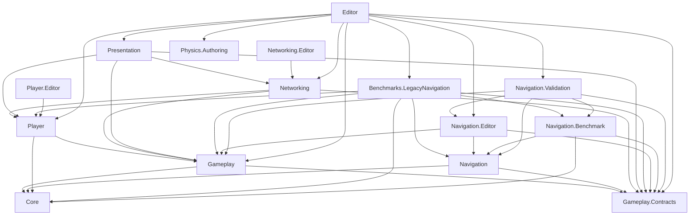

# 程序集迁移实施与最终收紧

[返回架构总览](README.md)

> 状态：阶段零至阶段七实现完成；当前静态审计覆盖 331 个脚本、15 个 asmdef 和 0 个 asmref，旧 Stage Seven Unity 总验收入口仍需补登记 Navigation Benchmark 与 Validation 程序集
>
> 本文合并原阶段零至阶段六验收文档，并记录阶段七最终结构
>
> 项目业务脚本已全部离开预定义 `Assembly-CSharp`

## 1. 迁移目标与最终结果

这次迁移的目标不是增加 asmdef 数量，而是把原本依赖目录和约定维持的模块边界变成编译器可以检查的单向依赖。

截至 2026-08-22，当前结果如下：

- 331 个 `Assets/Scripts` C# 文件全部进入明确的项目程序集
- 15 个项目 asmdef 全部使用稳定 GUID 和根命名空间
- 项目 asmref 为 0
- 全项目不存在全局命名空间业务脚本
- Runtime、Editor、Authoring 和 Benchmark 不再混合编译
- 项目 asmdef 的 `Auto Referenced` 全部关闭
- 项目程序集之间没有直接循环依赖
- 程序集审计没有 Warning、严重问题或边界违规
- Scene、Prefab、ScriptableObject、SubScene 和 Ghost 类型迁移均保留原脚本 `.meta` GUID

关闭 `Auto Referenced` 后，预定义程序集不能再隐式访问项目业务 API。新增跨模块调用必须在 asmdef 中声明依赖，因此目录规范之外又增加了一层真实的编译器门禁。

## 2. 阶段零：迁移前审计

阶段零于 2026-07-18 完成，审计基线 Commit 为 `8723acb33d4527c44128bc89088d0ea4012c108e`。

### 2.1 审计工具

阶段零建立了三个持续保留的工具：

- `Tools/AssemblyMigrationRules.psd1`：按路径前缀定义脚本归属、程序集、生命周期、命名空间和允许依赖
- `Tools/AuditAssemblyMigration.ps1`：检查脚本归属、命名空间、Runtime/Editor 混编、asmdef、asmref 和项目依赖
- `Tools/GlobalNamespaceBaseline.txt`：冻结迁移前的全局命名空间脚本，只允许删除基线条目

运行命令：

```powershell
powershell.exe -NoProfile -ExecutionPolicy Bypass `
  -File .\Tools\AuditAssemblyMigration.ps1 `
  -JsonOutputPath Temp\AssemblyMigrationAudit.json
```

依赖分析根据项目类型名和源文件标识符做启发式匹配，可以用于发现候选引用和直接循环，但不能代替 Roslyn 语义分析与真实 Unity asmdef 编译。因此每阶段都继续执行 Unity 导入、Source Generator 和 Player 构建验证。

### 2.2 迁移前快照

阶段零覆盖 260 个脚本：

- 260 个脚本全部具有候选程序集归属
- 40 个脚本已有命名空间，220 个仍在全局命名空间
- 候选跨模块依赖为 42 条
- 候选直接双向依赖为 12 组
- Navigation 没有外部项目业务依赖
- 10 个脚本存在 Runtime 与 Editor 条件编译混合

主要双向风险来自：

- Anis、Base、Health、Resource、Global 和 Player 之间的具体实现引用
- 正式 Ani、Resource 与 Legacy Navigation 的移动实现引用
- Mono、Networking、Resource 和 UI 之间的表现桥接引用

需要最终拆分的混编脚本包括 Navigation 的 Authoring、Bake Asset、Baker、Bake Utility，以及 Networking 的 Bootstrap、运行角色、连接、监听和调试 InGame System。

### 2.3 阶段零决策

审计后确定以下迁移顺序：

1. 先用没有外部业务依赖的 Navigation 建立第一个 asmdef
2. 再提取 Core 与 Gameplay Contracts
3. 清理 Gameplay 对 Player、Mono、Networking 和 Legacy 的反向依赖
4. 分别迁移 Player、Networking 和 Presentation
5. 最后隔离 Legacy Benchmark 并拆分 Editor 边界

阶段零没有修改玩法行为。外部 `dotnet build` 为零 Error，但存在 Unity Package Warning 和 NetCode Source Generator 的外部环境差异，因此后续以 Unity 真实编译结果为最终依据。

## 3. 阶段一：Navigation 试点

阶段一于 2026-07-18 完成，创建项目第一个程序集 `AnimarsCatcher.Navigation`。

### 3.1 第一轮边界

第一轮把当时位于 `Assets/Scripts/Navigation/Grid` 的代码整体迁入同一程序集，覆盖：

- Grid 运行时数据和算法
- Job 与路径 System
- Authoring 与 Baker
- Editor 烘焙工具和阶段验收入口

当时没有立即拆分 Editor 程序集，因为 `NavigationGridBaker` 仍在 Editor 条件下调用 `NavigationGridBakeUtility`。直接拆分会产生 Runtime 或 Authoring 到 Editor 的非法反向依赖，因此先用单程序集验证 asmdef、序列化和 Player 编译链路。

阶段一期间 `Auto Referenced` 暂时开启，使仍位于 `Assembly-CSharp` 的上层代码能够消费 Navigation 公共 API。阶段七在全部业务脚本完成迁移后关闭了该设置。

### 3.2 序列化迁移

原脚本 `.meta` GUID 保持不变。以下固定资源的程序集限定类型名同步迁移到 `AnimarsCatcher.Navigation`：

- `Assets/Scenes/Benchmarks/SCN_GridBakeStage1.unity` 中的 `NavigationGridAuthoring`
- `Assets/SO/Navigation/SO_NavigationGrid_SCN_GridBakeStage1.asset` 中的 `NavigationGridBakeAsset`

新增 `NavigationAssemblyMigrationValidation` 检查：

- Bake Asset 能按新类型加载
- Scene 中没有 Missing Script
- Scene 中只有一个 `NavigationGridAuthoring`
- Authoring 的 Bake Asset 引用没有丢失
- Authoring 与 Bake Asset 位于正确程序集

### 3.3 阶段一验收

阶段一通过：

- Unity Editor 完整脚本编译
- 固定 Grid Scene 与 Bake Asset 序列化检查
- Stage One Grid 烘焙与算法验收
- Stage Two 投影、寻路、平滑、失败状态和异步 ECS 写回验收
- Windows Client 最小构建
- Windows Dedicated Server 最小构建
- Server 与 Local World 创建路径系统，Client World 不创建路径系统

阶段快照为 261 个脚本、1 个项目 asmdef、220 个全局命名空间脚本和 10 条混编 Warning。

## 4. 阶段二：Core 与 Gameplay Contracts

阶段二于 2026-07-18 完成，新增 `AnimarsCatcher.Core` 和 `AnimarsCatcher.Gameplay.Contracts`。

### 4.1 Core 边界

Core 只保存没有玩法语义的通用 FSM 数据：

- `FsmBase.cs`：状态、条件、动作标识和实体状态机上下文
- `FsmBlackboardData.cs`：可同步黑板数据与类型安全读写
- `FsmGraph.cs`：不可变状态图 Blob

Ani 业务 ID、事件、Registry 生命周期和具体 System 没有进入 Core。Core 不依赖任何项目业务程序集。

### 4.2 Gameplay Contracts 边界

Contracts 保存确实需要跨领域和网络共享的数据：

- Ani、Base、Camp、Health、Match 和 Resource 相关 Component、Tag 与 Buffer
- `CampType`、`LocalPlayerCamp`、`DamageEvent`、`GameResult` 和 `MatchResultRpc`
- 资源分类、搬运分配、移动命令锁和拾取请求

Contracts 不保存具体 System、MonoBehaviour、Authoring、Baker、静态运行角色或 UI 实现。NetCode Ghost Serializer 需要的 Burst、Collections、Entities、Mathematics 和 NetCode 依赖均显式声明。

### 4.3 依赖收敛与兼容

共享数据提取后，直接双向依赖从 12 组降为 6 组。Base、Camp、Global、Health 和 Resource 之间由共享 Component 造成的候选循环消失。

移动文件时保留原 `.meta` GUID，没有复制兼容类型。Component、RPC 和 Ghost 契约的程序集限定名发生变化，因此 Client 与 Server 必须使用同一提交重新生成 Serializer 和 Entity Scene。

### 4.4 阶段二验收

阶段二使用完整项目物理副本通过：

- 全部 Assets 与 ProjectSettings 导入
- Unity Editor 脚本编译
- NetCode Ghost Serializer 与 Entities Source Generator
- Navigation Stage Two 和固定序列化资产
- Build Settings 三个真实场景的 Windows Client 构建
- Windows Dedicated Server 构建

阶段快照为 262 个脚本、3 个项目 asmdef、206 个全局命名空间脚本、6 组直接双向依赖和 0 个边界违规。

## 5. 阶段三：Gameplay

阶段三于 2026-07-19 完成，新增 `AnimarsCatcher.Gameplay`。

### 5.1 为什么使用一个 Gameplay 程序集

Anis、Base、Camp、Global、Health 和 Resource 共享服务端 Simulation 生命周期，并存在合理的同帧数据协作。把它们机械拆成六个 asmdef 会把更新顺序和状态访问重新变成程序集循环。

最终采用一个中心 asmdef 加六个 asmref：

- `Assets/Scripts/Gameplay/AnimarsCatcher.Gameplay.asmdef` 定义程序集
- Anis、Base、Camp、Global、Health 和 Resource 通过 asmref 加入
- Navigation 子目录继续由更具体的 Navigation asmdef 管理
- Contracts 子目录继续由 Contracts asmdef 管理

### 5.2 Gameplay 职责

Gameplay 包含 71 个脚本，负责：

- Ani 属性、攻击、感知、生成和 FSM 运行
- Base、Camp、Health、Match 和 Resource 权威规则
- Gameplay Authoring、Baker、Component 和更新组

Gameplay 不负责菜单与 HUD、网络 World 生命周期、Player 输入、Legacy NavMesh 实现或 Grid Navigation 实现。它只依赖 Core、Gameplay Contracts 和必要 Unity Package。

### 5.3 反向依赖清理

阶段三按数据所有权移动具体实现：

- `ClientWorldCommandClickInputSystem` 移到 Player 输入目录
- `ClientAniSpawnRequestSender` 移到 Mono 桥接目录
- 客户端 `MatchResultRpc` 消费与结算界面移到表现层
- Ghost Collection 调试 System 移到 Netcode Debug
- `ServerCampAssignmentPolicy` 不再读取进程级网络角色
- 资源初始化不再通过 `UpdateAfter` 引用 Networking 具体 System
- 依赖 NavMesh 的资源搬运 Setup 与 Move System 移入 Legacy Benchmark
- 资源调试 RPC 和 `ResourceItemKind` 进入 Contracts

攻击朝向通过 `GameplayPostMovementSystemGroup` 与旧移动顺序衔接，不再引用 Legacy 的具体 System 类型。

### 5.4 命名与序列化

六个领域的类型迁入 `AnimarsCatcher.Gameplay` 命名空间，原脚本 `.meta` GUID 保持不变。

`AniAttributes.MoveSpeed` 更名为 `MovementSpeed`，使用 `FormerlySerializedAs("MoveSpeed")` 保留 Inspector 数据。

### 5.5 阶段三验收

阶段三通过：

- Unity Editor 完整导入和编译
- Entities 与 NetCode Source Generator
- 全部 Scene 和 Prefab Missing Script 扫描，结果为 0
- Windows Client 真实场景构建
- Windows Dedicated Server 真实场景构建
- asmref GUID、依赖边界和注释规范检查

阶段快照为 4 个项目 asmdef、6 个 asmref、21 条候选跨模块依赖和 2 组直接双向依赖。剩余循环只在 Mono、Networking 和 UI 范围。

## 6. 阶段四：Player 与 Networking

阶段四于 2026-07-19 完成，新增：

- `AnimarsCatcher.Player`
- `AnimarsCatcher.Player.Editor`
- `AnimarsCatcher.Networking`

### 6.1 Player 边界

Player 保存：

- 设备输入、输入锁和 `InputCommand`
- 固定 Tick 输入事件
- KCC 与简化角色预测移动
- Fixed、Orbit 和主相机控制
- Player Character、Camera、Entity View 的 Authoring 与组件
- 过场相机占用状态

`CharacterBoxGeometryAuthoring` 从无归属 Physics 目录迁入 Player。`ClientPlayerInputLockFromUISystem` 因为订阅 Mono UI 事件而移到表现桥接层。`ClientCinematicState` 迁入 Player，使表现层可以控制相机让权，但 Player 不反向引用 Presentation。

### 6.2 Networking 边界

Networking 保存：

- `CustomBootstrap` 和网络运行角色
- Client、Server 与 Thin Client World 创建
- 监听、连接、大厅、InGame 和 Spawn
- Ghost Variant、网络探针和调试 HUD
- 网络生命周期与场景加载通知数据

Networking 允许依赖 Gameplay Contracts、Gameplay、Player 和必要 Unity Package，不依赖 Mono 或 UI。

### 6.3 网络表现桥

迁移前 Networking 直接调用旧网络 UI 事件桥、`GlobalLoadingUI` 和表现状态，形成 Runtime 到 Mono 的反向依赖。

阶段四增加 `NetworkLifecycleNotifications`，由 Networking 产生短生命周期 ECS 通知。`NetworkPresentationBridgeSystem` 在表现层消费通知，再驱动房间 UI、加载遮罩、场景切换和开场演出。

依赖方向因此固定为：

```text
Presentation -> Networking / Player
```

### 6.4 命名空间与序列化

Player、Player Editor 和 Networking 使用各自根命名空间。移动 `CharacterBoxGeometryAuthoring`、`ClientCinematicState`、`NetworkRunRole` 和输入锁桥接时均保留原 `.meta` GUID。

Mono 输入桥命名空间避免使用会遮蔽 `UnityEngine.Input` 的名称，防止常用 Unity 类型产生模糊解析。

### 6.5 阶段四验收

阶段四使用完整物理副本通过：

- Unity 完整导入和脚本编译
- Player、Player Editor 和 Networking 类型归属
- Entities 与 NetCode Source Generator
- `InputCommand`、RPC 和 Ghost Variant 生成
- 全部 Scene 和 Prefab Missing Script 扫描
- Windows Client 构建
- Windows Dedicated Server 构建

阶段快照为 267 个脚本、7 个项目 asmdef、6 个 asmref、56 个全局命名空间脚本和 1 组直接双向依赖。最后一组循环为 Mono 与 UI。

## 7. 阶段五：Presentation

阶段五于 2026-07-19 完成，新增 `AnimarsCatcher.Presentation`，并为已有第三方扩展源码补充 `DOTween.Modules` 兼容 asmdef。

### 7.1 为什么合并 Mono 与 UI

原 MonoBehaviour 与 UI 目录共享客户端表现生命周期：

- ECS 选择 System 读取 Mono UI Bootstrap 与事件
- Mono 面板读取选择、资源和网络生命周期状态
- 血条 System 创建 GameObject View
- 网络表现桥在 ECS World 中消费通知后驱动场景对象

拆成两个程序集会保留双向依赖或制造只用于转发的空接口，因此 53 个脚本统一进入 Presentation，同时保留原物理目录，并通过两个 asmref 聚合。

Presentation 只依赖 Gameplay Contracts、Gameplay、Player 和 Networking。运行时业务程序集不反向引用 Presentation。

### 7.2 Presentation 职责

Presentation 覆盖：

- 账号与进程内玩家会话
- 音乐、音效和音频设置
- 网络生命周期、比赛结果和加载桥
- LAN 发现
- Ani 框选、选择模式和选择 RPC
- 血条 Authoring、托管 View 和生成 System
- 菜单、HUD、转场、结算和小地图

它可以读取权威状态或提交请求，但不拥有服务器权威业务数据。

### 7.3 DOTween 与独立编译问题

DOTween 核心是预编译 DLL，但 `DOFade`、`DOAnchorPos` 等扩展来自 Modules 源码。阶段五增加最小 `DOTween.Modules` asmdef，显式引用 DOTween 和 Unity UI，不修改第三方运行时代码。

独立程序集编译同时暴露并修复：

- 两个 Authoring 内部 `Baker` 名称与泛型基类解析冲突
- 托管组件参与 `SystemAPI.QueryBuilder` 导致 Entities Source Generator 异常
- `HealthUI` 命名空间与 Gameplay Contracts 的 `Health` 类型遮蔽

### 7.4 阶段五验收

阶段五通过：

- Unity 完整导入和脚本编译
- Entities 与 NetCode Source Generator
- Presentation 与 DOTween Modules 程序集生成
- 代表性 Presentation 类型归属检查
- 全部 Scene 和 Prefab Missing Script 扫描
- Windows Client 构建
- Windows Dedicated Server 构建

阶段快照为 268 个脚本、8 个项目 asmdef、8 个项目 asmref、28 个全局命名空间脚本、0 组直接双向依赖和 17.36% 总注释率。

## 8. 阶段六：Legacy Benchmark

阶段六于 2026-07-19 完成，新增 `AnimarsCatcher.Benchmarks.LegacyNavigation`。

### 8.1 Benchmark 边界

24 个脚本统一保存旧移动性能基线：

- 旧 Movement FSM 与 Planner
- 固定矩形阵型
- 服务端移动命令消费者
- 逐 Ani NavMesh 路径规划与跟随
- 旧 Physics 探测和移动
- 依赖 NavMesh 的资源搬运适配

阶段六完成时，Benchmark 只依赖 Core、Gameplay Contracts、Gameplay 和 Player。后续为了在同一 Harness 中运行 Grid 工作负载，当前 Legacy Benchmark 还显式依赖 Navigation 与 Navigation Benchmark；正式 Runtime 程序集仍不能反向引用 Legacy Benchmark。

### 8.2 当前运行事实

程序集隔离不等于运行时后端已经切换。当前正式 Prefab 仍包含部分 Legacy Authoring：

- Picker 与 Blaster Ani Prefab 仍有 `AniMovementFsmAuthoring`
- Picker 与 Blaster Ani Prefab 仍有 `NavAgentAuthoring`
- Picker 与 Blaster Ani Prefab 仍有 `AniPhysicsAuthoring`
- 多个可拾取资源 Prefab 仍有 `NavAgentAuthoring`

因此 Benchmark 仍是活动实现基线，不能直接禁用。后端互斥已经完成；正式 Grid 后端切换和 Prefab 清理继续由 Grid 移动计划管理。

### 8.3 命名空间与依赖

24 个脚本统一迁入 `AnimarsCatcher.Benchmarks.LegacyNavigation`，保留原路径和 `.meta` GUID。阶段六移除了未使用的 `Unity.VisualScripting` 引用。

`UnityEngine.AI.NavMesh` 属于 Unity Engine 模块，不需要引用 `Unity.AI.Navigation` 包程序集。阶段六当时暂时保持 `Auto Referenced`，阶段七在全部业务脚本迁移完成后统一关闭。

### 8.4 阶段六验收

阶段六通过：

- Unity 完整导入和脚本编译
- Benchmark NetCode Ghost 代码生成
- Benchmark 代表类型程序集归属
- Picker、Blaster 和资源 Prefab 的 Legacy Authoring 绑定检查
- 全部 Scene 与 Prefab Missing Script 扫描
- Windows Client 构建
- Windows Dedicated Server 构建

阶段快照为 269 个脚本、9 个项目 asmdef、8 个项目 asmref、6 个全局命名空间脚本、0 组直接双向依赖和 17.28% 总注释率。

阶段六没有执行实际 NavMesh 性能采样。固定命令回放、32/64/128 Ani 场景和 P50/P95/P99 数据仍属于 Benchmark Harness 工作。

## 9. 阶段七：最终依赖收紧

阶段七于 2026-07-19 完成实现，负责清理剩余 `Assembly-CSharp` 内容和迁移期配置。

### 9.1 剩余程序集迁移

阶段七新增或明确以下边界：

- `AnimarsCatcher.Navigation.Editor`
- `AnimarsCatcher.Networking.Editor`
- `AnimarsCatcher.Physics.Authoring`
- `AnimarsCatcher.Editor`

原全局 Editor 工具进入 `AnimarsCatcher.Editor`。Capsule Physics 与 Terrain Collider Authoring 进入 `AnimarsCatcher.Physics.Authoring`，Terrain 目录通过 asmref 汇入。

`AnimarsCatcher.Physics.Authoring` 直接引用 Unity Physics Custom Sample，因为 `TerrainColliderAuthoring` 使用其中的 `PhysicsMaterialTemplate`。这是明确登记的 Authoring 依赖，不是项目业务反向依赖。

### 9.2 Navigation Editor 拆分

阶段七当时把 Navigation 的物理采样、可视化和验收工具统一放入 `AnimarsCatcher.Navigation.Editor`。后续 Navigation 架构重构又把自动夹具和 Benchmark 消费者分别拆入 `AnimarsCatcher.Navigation.Validation` 与 `AnimarsCatcher.Navigation.Benchmark`，Editor 只保留采样、Inspector、可视化和构建校验。

运行时 Baker 不再调用 Editor Bake Utility，只验证固定 Bake Asset 是否可用。场景与烘焙结果的新鲜度由 Editor 构建门禁负责，从而消除 Runtime 到 Editor 的反向依赖。

### 9.3 Networking Editor 配置桥

Networking 原有 6 个 Runtime 脚本通过 `UNITY_EDITOR` 读取 Multiplayer PlayMode 或启用调试握手。

阶段七增加 `NetworkPlayModeConfiguration`：

1. `AnimarsCatcher.Networking.Editor` 在编辑器加载和进入 Play Mode 时读取 PlayType 与 Thin Client 数量
2. Editor 程序集把配置写入纯运行时数据桥
3. Networking Runtime 只读取桥接结果，不引用 `UnityEditor`
4. Player 构建按命令行和 NetCode 编译角色决定 Host、Client 或 Dedicated Server

角色检测同时统一识别 `-dedicated`、`-server` 和 `-serverui`，避免请求监听却没有创建 Server World。

### 9.4 Auto Referenced 与未使用引用

15 个项目 asmdef 全部关闭 `Auto Referenced`。跨模块访问必须使用显式 GUID 引用。

Presentation 没有使用 `Unity.Networking.Transport`，阶段七删除了该直接引用。DOTween Modules 和 Unity Physics Sample 属于第三方或 Sample 文件，不纳入项目 asmdef 的批量修改范围。

### 9.5 asmref 清理结果

阶段七完成时曾保留 9 个用于多目录归属的 asmref。后续文件夹迁移把相关脚本收拢到对应 asmdef 覆盖范围后，这 9 个 asmref 已全部删除。当前项目 asmref 为 0，审计仍禁止用 asmref 隐藏循环依赖、跨越 Runtime 与 Editor 或绕过模块所有权。

## 10. 最终程序集划分

运行时与数据边界包括：

- `AnimarsCatcher.Core`：通用 FSM 和不含玩法语义的底层数据
- `AnimarsCatcher.Gameplay.Contracts`：跨玩法与网络共享的 ECS 契约
- `AnimarsCatcher.Gameplay`：Anis、Base、Camp、Global、Health、Resource 和 Gameplay Runtime
- `AnimarsCatcher.Navigation`：Grid 数据、算法、Job、System、Authoring 和 Baker
- `AnimarsCatcher.Player`：输入、预测移动、相机和玩家角色控制
- `AnimarsCatcher.Networking`：World 创建、连接、监听、大厅、InGame、Spawn 和网络生命周期
- `AnimarsCatcher.Presentation`：Mono UI、ECS UI、音频、LAN、HUD、场景过渡和 GameObject View

编辑器与烘焙边界包括：

- `AnimarsCatcher.Navigation.Editor`：Grid 采样、Inspector、可视化和构建校验
- `AnimarsCatcher.Navigation.Validation`：Stage 1～5、R6 算法夹具和结构回归
- `AnimarsCatcher.Navigation.Benchmark`：Path/Field 与 Squad Benchmark 工作负载和结果导出
- `AnimarsCatcher.Networking.Editor`：读取 NetCode Multiplayer PlayMode 配置并写入运行时配置桥
- `AnimarsCatcher.Player.Editor`：Input System 编辑器检查
- `AnimarsCatcher.Physics.Authoring`：胶囊体和 Terrain Collider 烘焙
- `AnimarsCatcher.Editor`：项目工具和程序集迁移总验收入口

性能基线由 `AnimarsCatcher.Benchmarks.LegacyNavigation` 单独承载。

## 11. 最终依赖图

箭头从使用方指向被依赖方。



Navigation 只依赖 Core 和 Gameplay.Contracts，不依赖 Gameplay、Player 或 Benchmark。Core 承载无玩法语义的数学与数据结构，Contracts 承载跨模块数据契约，Navigation 在此基础上实现 Grid 算法、Job 和 System。

## 12. 序列化与生成代码原则

整个迁移过程遵循以下兼容策略：

- 移动脚本时连同 `.meta` 一起移动，保持 GUID 不变
- Scene、Prefab 和 ScriptableObject 的程序集限定类型名发生变化时显式迁移固定资源
- 字段改名使用 `FormerlySerializedAs`，不通过重新创建组件丢弃 Inspector 数据
- Client 与 Server 使用同一提交重新生成 Ghost Serializer、RPC、Entity Scene 和 SubScene 数据
- 每阶段扫描正式 Scene 与 Prefab 的 Missing Script
- 不通过复制类型、保留双份声明或重建 `.meta` 绕过迁移问题

项目不承诺程序集迁移前后的旧 Client 与新 Server 协议兼容。

## 13. 自动门禁

`Tools/AuditAssemblyMigration.ps1` 当前检查：

- 每个脚本都能匹配唯一迁移规则
- 命名空间符合程序集归属
- Runtime 与 Editor 没有混合编译
- 所有项目 asmdef 和 asmref 都已登记
- asmdef 名称、根命名空间、GUID 引用和 `Auto Referenced` 策略正确
- 项目依赖符合允许列表
- 不存在直接双向依赖、全局命名空间或陈旧基线

`AssemblyMigrationStageSevenValidation` 负责串联迁移期阶段验收，但当前仍保留迁移完成时的 13 程序集清单。由于后来增加了 `AnimarsCatcher.Navigation.Benchmark` 和 `AnimarsCatcher.Navigation.Validation`，它的 asmdef 数量断言尚未同步，当前不能作为 15 程序集总验收入口。修正该入口后应继续检查：

- 15 个项目程序集均被 Unity 发现
- Physics Authoring 代表类型位于正确程序集
- 全部项目 asmdef 关闭 `Auto Referenced`
- Player Editor、Networking Editor 和 Navigation Editor 存在
- Gameplay、Presentation 和 Legacy 的场景与 Prefab 回归入口继续通过
- Navigation 固定测试资产、Stage One 和 Stage Two 继续通过

## 14. 验收历史与当前状态

阶段一至阶段六均在完整物理副本或对应最小构建中实际通过 Unity 编译。高层模块迁移阶段反复覆盖：

- Unity Editor 完整导入
- Entities 与 NetCode Source Generator
- Ghost、RPC 和 `InputCommand` 生成
- Scene、Prefab、ScriptableObject 和 SubScene 序列化
- Missing Script 扫描
- Windows Client 构建
- Windows Dedicated Server 构建

迁移阶段完成后，当前仓库已经验证：

- 程序集迁移审计通过，331 个脚本全部归属 15 个 asmdef，0 个 asmref
- 全局命名空间、Warning、严重问题、循环依赖和边界违规均为 0
- Navigation R6 的 Stage 1～5、结构检查、算法夹具和 32/64/128 双轮基准全部通过
- 15 个实际项目 `.csproj` 均可独立完成编译，0 个错误

当前仍需完成：

1. 把 Navigation Benchmark 与 Validation 加入 `AssemblyMigrationStageSevenValidation`，再运行该入口
2. Windows Client 构建
3. Windows Dedicated Server 构建

这三项属于最终发布门禁，不影响阶段七代码和程序集结构已经实现的事实。

## 15. 后续维护

程序集迁移本身已经结束。后续新增模块时应从现有边界中选择归属，只有生命周期和依赖方向确实不同才新增 asmdef。

下一项结构工作不是继续细拆程序集，而是建立独立 Tests 程序集，并为以下链路增加持续验证：

- 服务端权限和资源事务
- Network PlayMode 配置桥
- Grid 正式移动后端
- Legacy 与 Grid 后端互斥
- Client 与 Dedicated Server 构建

Benchmark Harness、固定命令回放、32/64/128 Ani 性能场景以及 P50/P95/P99 数据继续由 Grid 移动性能计划管理，不与程序集边界维护混在一起。
