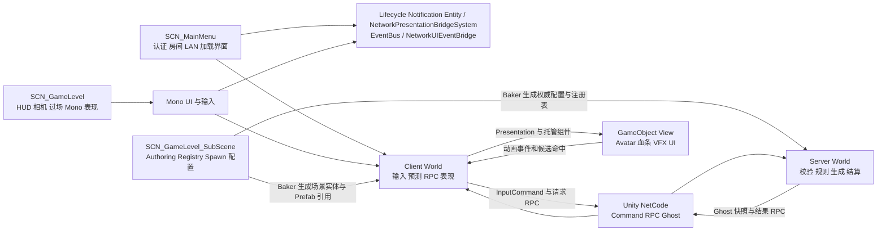

# AnimarsCatcher 项目架构总览

[返回项目文档总目录](../README.md)

01 至 07 描述当前仓库实现，是理解和维护项目的事实基线，不替代 [开发规范](../Standards/DevelopmentGuidelines.md)。08 描述 Grid 移动目标架构，09 记录性能基准方法，10 同时记录阶段计划和实际进度，11 记录程序集迁移方案，12 至 16 记录阶段零至阶段四的实施结果。Grid 烘焙、端点投影和普通 A* 路径服务已经实现，HPA*、阵型、避碰和正式后端切换仍是后续工作。如果代码与事实文档不一致，应先以实际运行结果为准，再同步修正文档。

## 1. 技术基线

项目建立在 Unity DOTS 和 NetCode 之上，同时保留 GameObject UI、相机和表现层。当前采用的主要版本如下：

- Unity 使用 `6000.2.7f2`
- Entities 使用 `1.4.3`，具体版本以 `packages-lock.json` 为准
- NetCode 使用 `1.9.0`
- Unity Physics 使用 `1.3.14`
- Character Controller 使用 `1.3.12`
- Entities Graphics 使用 `1.4.16`
- URP 使用 `17.2.0`
- Input System 使用 `1.14.2`

仓库中目前有 267 个自有业务脚本。Core、Gameplay Contracts、Navigation、Gameplay、Player、Player Editor 和 Networking 已进入 7 个自定义程序集，Mono、UI、Legacy Benchmark 和少量 Authoring、Editor 代码仍主要编译到 `Assembly-CSharp`。

当前没有独立的 `Assets/Tests` 测试程序集。`Assets/SO` 已用于保存 `NavigationGridBakeAsset`，其他静态配置仍主要来自 Authoring、Prefab、场景实体、Build Profile 和 `ProjectSettings`。

## 2. 文档阅读顺序

第一次接触项目时，建议按照下面的顺序阅读。前几份文档先建立整体认识，后几份再深入具体链路和风险：

1. [模块与资产地图](01_ModuleMap.md)：先了解各代码目录负责什么，以及 Scene、SubScene 和 Prefab 如何组织
2. [ECS 数据模型](02_ECSDataModel.md)：了解 Entity 由哪些 Component、Buffer 和 Tag 组成，以及 Authoring、Baker、System 如何衔接
3. [客户端与服务端边界](03_NetworkBoundaries.md)：确认 World、Ghost、Command 和 RPC 分别解决什么问题，并理解数据所有权
4. [启动、连接与开局链路](04_StartupAndMatchFlow.md)：沿着程序启动、LAN 房间、场景加载、进入 InGame 和角色出生的顺序阅读
5. [核心玩法链路](05_GameplayFlows.md)：查看玩家移动、Ani 选择与移动、战斗、资源和胜负的完整数据流
6. [关键类与扩展点](06_KeyClasses.md)：需要定位代码或增加功能时，从入口类、桥接类、Aspect 和工具类开始查找
7. [已知边界与演进方向](07_KnownRisks.md)：修改公共逻辑前，先确认当前的安全、生命周期、性能和结构风险
8. [RTS 2.5D Grid 导航、自适应阵型与避碰方案](08_AdaptiveFormationNavigationPlan.md)：查看零 NavMesh 的 Grid 烘焙实现，以及路径、阵型、局部避碰和物理移动目标架构
9. [Legacy NavMesh 与 Grid 性能基准](09_GridMovementImplementationBenchmark.md)：查看 Legacy 基线、后端互斥、命令回放和对比指标
10. [Grid 移动实现阶段与验收标准](10_GridMovementStagesAndAcceptance.md)：查看各阶段交付物、退出条件、场景矩阵和最终门禁
11. [程序集定义迁移前置计划](11_AssemblyDefinitionMigrationPlan.md)：查看 asmdef 创建前的依赖审计、序列化迁移、实施顺序和回滚标准
12. [程序集迁移阶段零审计](12_AssemblyMigrationPhaseZeroAudit.md)：查看脚本归属、命名空间覆盖、候选循环依赖和 Navigation 试点结论
13. [Navigation 程序集试点](13_AssemblyMigrationPhaseOneNavigation.md)：查看 asmdef 配置、序列化迁移、审计门禁和 Editor、Player 验证结果
14. [Core 与 Gameplay Contracts 迁移](14_AssemblyMigrationPhaseTwoCoreContracts.md)：查看通用 FSM 数据、共享玩法契约、依赖收敛和真实场景构建结果
15. [Gameplay 程序集迁移](15_AssemblyMigrationPhaseThreeGameplay.md)：查看六个玩法领域的合并边界、asmref 组织、反向依赖清理和 Player 验证结果
16. [Player 与 Networking 程序集迁移](16_AssemblyMigrationPhaseFourPlayerNetworking.md)：查看输入预测、连接生命周期、网络表现桥接、NetCode 生成和 Client、Server 构建结果

## 3. 总体运行架构

运行时同时存在 GameObject 场景和 ECS World。主菜单与游戏场景承载用户界面和客户端表现，SubScene 负责把 Authoring 配置烘焙为 Entity 数据。客户端通过 Command 或 RPC 提交输入和请求，服务器执行权威规则，再通过 Ghost 快照或结果 RPC 把状态同步回来。

这张图强调的是数据由谁产生、由谁决定、最终由谁显示。理解项目时可以先抓住三个边界：服务器决定玩法结果，客户端负责输入与表现，Scene 和 Prefab 通过 Baker 为两个 World 提供初始数据。

## 4. 核心设计原则

当前实现遵循以下分工。新增功能应先判断它属于权威规则、玩家输入还是视觉表现，再选择对应的 World 和通信方式。

- **服务器决定结果**：Server World 负责阵营分配、出生、实体生成、Ani 指令结果、伤害、资源和胜负
- **客户端提供输入与表现**：Client World 负责设备输入、本地预测、框选、射线候选、动画时机和画面表现
- **通信方式按用途选择**：`InputCommand` 传递逐 Tick 的预测输入，RPC 处理一次性请求，Ghost 持续同步状态
- **配置先经过烘焙**：Authoring 和 Baker 把 Scene 或 Prefab 中的配置转换为运行时 Entity 数据与 Prefab 注册表
- **视图只消费状态**：Hybrid View 读取 ECS 状态并生成 GameObject 表现，不直接持有服务器权威业务状态
- **模块隔离正在渐进落地**：Core、Gameplay Contracts、Navigation、Gameplay、Player 和 Networking 已有 asmdef 编译边界，Presentation、Legacy Benchmark 和剩余 Editor、Authoring 仍在后续迁移范围

## 5. 当前构建入口

`ProjectSettings/EditorBuildSettings.asset` 当前启用了三个场景，正式流程从主菜单进入游戏场景：

1. `Assets/Scenes/SCN_MainMenu.unity`
2. `Assets/Scenes/LevelScene/SCN_GameLevel_SubScene.unity`
3. `Assets/Scenes/LevelScene/SCN_GameLevel.unity`

其中，`SCN_MainMenu` 是用户进入项目后的主要入口，`SCN_GameLevel` 是正式玩法场景，`SCN_GameLevel_SubScene` 提供 ECS 场景数据。

`SCN_Main`、`SCN_Start`、`SCN_MainTest` 和 `SCN_Level` 不在当前 Build Settings 中，主要保留旧场景或测试内容。正式玩法入口以 `SCN_MainMenu -> SCN_GameLevel` 为准。

## 6. 什么时候更新这些文档

架构文档记录的是当前实际实现，而不是一次写完后长期不变的设计稿。出现下面任一变化时，应同步更新本目录：

- 新增或删除 World、Ghost、RPC、Command 或关键单例
- 调整系统的 `WorldSystemFilter`、System Group 或显式更新顺序
- 改变主菜单、游戏场景、SubScene 或 Prefab 注册关系
- 改变客户端请求与服务器校验边界
- 新增跨 ECS/Mono、跨 World 或跨模块桥接
